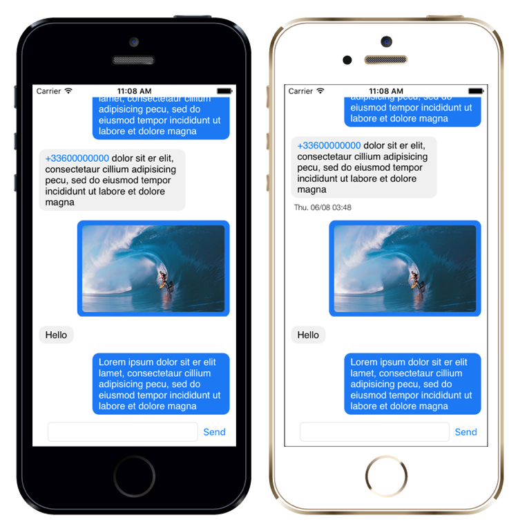

# FTChatViewController


FTChatViewController is a Custom ViewController designed in Swift (2.0) to implement a message thread in your iOS (8.0+) application. This look as follow :



## Installation
### Podfile
TODO

### Manual Way
TODO

## How to use

### Integration
Add the ```FTChatViewController``` in a ViewController. For example :

```swift
let storyboard = UIStoryboard(name: "Main", bundle: nil)
if let chatViewController = storyboard.instantiateViewControllerWithIdentifier("ChatViewController") as? FTChatViewController {
	self.view.addSubview(chatViewController.view)
	self.addChildViewController(chatViewController.chatVC)
}
```

### FTMessage

The FTMessage class look like this :

```swift
class FTMessage:AnyObject{
    var content:String?
    var image:UIImage?
    var date:NSDate
    var source:FTMessageSource
```

The ```FTMessageSource``` source field allow you to indicate whether the message comes from the user ```.Local``` or from outside ```.Remote```.

You have two init methods for an FTMessage depends on whether you want a text message or an image message.

```swift
//text message
init(messageWithContent content:String, atDate date:NSDate, from source:FTMessageSource)
//image message
init(messageWithImage image:UIImage, atDate date:NSDate, from source:FTMessageSource)
```

### Add messages to the FTChatViewController of message
Adding messages is very simple. You juste have to use :

```swift
func addMessage(message: FTMessage)
func addMessages(messages: [FTMessage])
```

The messages will automaticaly be sorted by date. Then, following messages will be group in the thread discussion with a lesser space between them.

### Display Details

Just tap the cell to display detail (the date of the message) and tap again to hide this.
